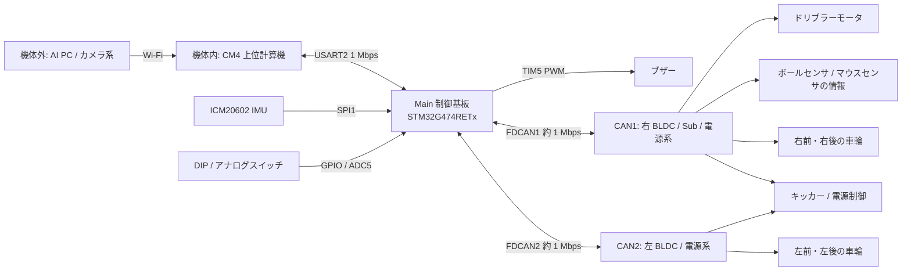

# 機体内の制御機構成

この文書は本リポジトリの Main ファームウェアから確認できる制御機の役割と通信経路をまとめる。基板間の物理配線、電源系統、各基板の回路構成は回路図で照合していない。CAN の接続先は送信先 ID と受信情報から見た論理構成である。

## 全体像

図の CAN1 側に示した Sub、ボールセンサ、マウスセンサの物理的な結線先は未確認。Sub のファームウェア照会は CAN1 宛てだが、通常のセンサ受信処理は CAN1/CAN2 の両方に共通である。

## 制御機と役割

| 機器 | Main ファームウェアから分かる役割 | 主な接続 |
| --- | --- | --- |
| CM4 上位計算機 | AI PC からの速度、目標角度、キック、ドリブル、ビジョン情報を Main に渡し、Main の状態情報を受け取る。ファームウェア更新も指示する。 | Main と USART2、1 Mbps |
| Main 制御基板（STM32G474RETx、Cortex-M4F） | 500 Hz で姿勢・オドメトリ更新、速度・車輪角度制御、停止判定、CAN 指令生成を実行する。IMU と操作スイッチを直接読む。 | SPI1、ADC/GPIO、USART2、FDCAN1/2 |
| 右 BLDC 基板 | 右前・右後の車輪モータを駆動し、回転速度、エンコーダ角度、電流、温度等を返す。 | FDCAN1、走行指令 ID `0x100`/`0x101` |
| 左 BLDC 基板 | 左後・左前の車輪モータを駆動し、同様のフィードバックを返す。 | FDCAN2、走行指令 ID `0x102`/`0x103` |
| Sub 基板 | ファームウェア上は独立した CAN ノードとして扱う。ボール検出とマウスセンサのデータを Main が CAN で受信する。ドリブラー指令は CAN1 の ID `0x104`。センサとドリブラーの基板上の実装範囲は未確認。 | Sub のファームウェア照会は FDCAN1、node 4 |
| 電源基板 | 電源の ON/OFF、保護パラメータ、キッカーの充電・電圧・種類・発射指令を受ける。バッテリ電圧、キャパシタ電圧、温度等を返す。 | 指令は FDCAN1/2 の両方へ送信、node 100 |

走行用 BLDC のファームウェア照会先は右が CAN1/node 16、左が CAN2/node 17。電源基板は両バスに照会する。キッカーと電源指令も両バスに同じ CAN ID を送る。実際にどちらのバスで各基板が受けるかは回路図での確認が必要。

## 制御と情報の流れ

1. AI PC からの指令は Wi-Fi 経由で CM4 に届き、CM4 が USART2 で Main に送る。通常の制御指令は 72 byte、Main からの通常テレメトリは 128 byte である。
2. Main は TIM7 の 2 ms 周期で指令・モードスイッチ・通信状態を確認する。IMU の yaw、車輪エンコーダ、マウスセンサ、外部ビジョンを姿勢・位置推定に使う。
3. Main は目標並進速度を加速度制限し、旋回指令と合わせて 4 輪の目標回転へ変換する。各輪の角度と回転速度のフィードバックから出力を計算し、CAN で左右 BLDC 基板へ送る。
4. キッカーとドリブラーは指令とボール検出を基に制御する。Main は電源系の状態、モータ状態、エラーを CAN で受け取り、CM4 へテレメトリを返す。
5. 停止要求、CAN 受信タイムアウト、エンコーダ初期化未完了、非常停止指令、ビジョン喪失などでは走行出力を停止する。エラー時は電源制御も停止側へ移す。

速度指令から各輪の CAN 出力までのブロック図は [hw_control.md](hw_control.md) を参照。

## 保守・更新経路

Main には基板専用ブートローダーと A/B アプリ領域がある。CM4 は USART2 経由で Main の更新を要求できる。Sub、左右 BLDC、電源基板の更新時は、Main の `fw_update_gateway.c` が CM4 からの要求を FDCAN1/2 の対象ノードへ中継する。更新中は通常の制御周期とブザー PWM を停止する。詳細は [bootloader.md](bootloader.md) を参照。

## 根拠と確認範囲

- MCU、ピン、通信設定: [board_spec.md](board_spec.md)、`G474_Orion_main.ioc`
- 車輪、ドリブラー、電源・キッカーの CAN 送信先: `Core/Src/actuator.c`
- CAN フィードバックと Sub の受信状態: `Core/Src/can_ibis.c`
- 500 Hz 制御、CAN 受信、ファームウェア照会先: `Core/Src/main.c`
- 制御計算と停止条件: `Core/Src/state_func.c`、`Core/Src/stop_state_control.c`、[hw_control.md](hw_control.md)
- 上位指令の意味: [ai_cmd_definition.md](ai_cmd_definition.md)
