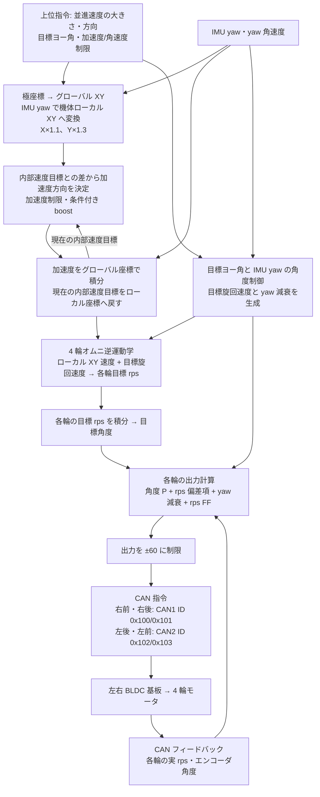

# Orion MAIN_MODE_FULL_AI_CONTROL の速度制御

この文書は `MAIN_MODE_FULL_AI_CONTROL` で `Core/Src/state_func.c` の `maintaskRun()` から呼ばれる速度制御系を、現行ソースコードに合わせて整理したものです。
主制御は TIM7 割り込み内で 500Hz（2ms 周期）実行されます。

## 速度指令から車輪出力までの制御ブロック図

`MAIN_MODE_FULL_AI_CONTROL` での 4 輪駆動を示します。矢印は値の流れで、Main 制御基板上の制御演算は 500 Hz 周期で実行します。最後の CAN 指令より先の BLDC 基板内部制御はこのリポジトリの対象外です。



モータ高温時は加速度の boost を省略します。

各輪の出力は `clamp(Kp × 目標角度と実角度の差, ±15) - Kd × (実 rps - 目標 rps) + ROBOT_RADIUS × yaw_rps_drag + 目標 rps` です。`omniMoveIndiv()` がこれを ±60 に制限して CAN へ送ります。`output.motor_voltage` は変数名であり、BLDC 基板へ送る duty / 電圧相当の指令値です。実際のモータ端子電圧ではありません。

この図の並進速度ループは、内部速度目標と上位指令の差を使います。`MAIN_MODE_FULL_AI_CONTROL` では実並進速度を直接 PID していません。実 rps とエンコーダ角度は各輪の制御へ戻ります。

## 全体の流れ

`MAIN_MODE_FULL_AI_CONTROL` の `maintaskRun()` は、次の順序で指令を処理します。

1. 上位指令をローカル速度目標へ変換する。
2. 加速度制限値を決める。
3. 現在の速度目標 `target.local_vel_now` を加速度制限で追従させる。
4. ヨー角目標から旋回速度 `target.yaw_rps` を決める。
5. 並進速度と旋回速度を各オムニホイールの目標 rps と目標角度へ変換する。
6. ホイール角度差、実 rps、ヨー減衰を使って各モータ出力を計算する。
7. 各輪の出力を制限して CAN へモータ指令を送る。

呼び出し順は以下です。

```text
setLocalTargetSpeed()
setTargetAccel()
accelControl()
accelBoost()  // モータ高温時は省略
speedControl()
thetaControl()
setTargetOmniAngle()
clearOmniRotationAngleErrorIfStopped()
omniAngleControl()
omniMoveIndiv()
```

## 入力と座標系

上位指令は `RobotCommandV2` で受信します。
現在サポートされている制御モードは `POLAR_VELOCITY_TARGET_MODE` です。

- `target_global_velocity_r`: グローバル座標での速度スカラー
- `target_global_velocity_theta`: グローバル座標での速度方向
- `target_global_theta`: グローバル座標での目標ヨー角
- `acceleration_limit`: 並進加速度制限
- `linear_velocity_limit`: 現状の速度制御レイヤでは直接使っていない
- `angular_velocity_limit`: ヨー速度制限

`setLocalTargetSpeed()` では、極座標の速度指令をグローバル XY に戻し、IMU yaw を使ってローカル XY に変換します。
その後、指令値段階の補正として X に 1.1 倍、Y に 1.3 倍を掛けています。

```text
global velocity polar
  -> global velocity xy
  -> local velocity xy
  -> target.local_vel
```

制御内部では以下の速度を分けて持ちます。

| 変数 | 意味 |
| --- | --- |
| `target.local_vel` | 上位指令から得た最終的なローカル速度目標 |
| `target.local_vel_now` | 加速度制限を通した現在のローカル速度目標 |
| `target.global_vel_now` | `local_vel_now` の積分をグローバル座標で保持したもの |

## 加速度制限

`setTargetAccel()` は上位指令の `acceleration_limit` を採用します。
ただし 3.0 未満または 20 超過の場合は 3.0 にフォールバックします。

`accelControl()` は `target.local_vel - target.local_vel_now` を速度誤差として見ます。
誤差方向へ、スカラー値 `accel_target` の加速度ベクトルを作ります。
ここでは速度誤差の大きさで加速度を弱めず、常に最大加速度を使います。

`speedControl()` は加速度をグローバル座標に変換してから `target.global_vel_now` に積分します。
ロボットが旋回していても、慣性をグローバル座標で扱うためです。
最後に `target.global_vel_now` をローカル座標へ戻し、次周期の `target.local_vel_now` とします。

速度誤差が 1 周期分の加速度以下になった場合は、目標速度へ直接スナップします。
これにより目標付近で小さな積分誤差が残るのを防いでいます。

## accelBoost()

`accelBoost()` は加速度指令に X 方向の追加補正を掛ける層です。

- X 方向加速度比率が大きい場合、X 加速度へ最大 1.5 倍の boost を掛ける。
- boost gain が 1.0 未満または 2.0 超過になった場合は 1.0 に戻す。

`maintaskRun()` ではモータ高温時に `accelBoost()` を呼ばないため、温度が高い場合は加速補正を抑制します。

## ヨー角制御

`thetaControl()` は `target_global_theta` と IMU yaw の角度差から `target.yaw_rps` を作ります。

- 角加速度上限は `8 * 2π rad/s^2`。
- 目標角との差が 10deg 未満の範囲では、加速上限を半分にする。
- 1deg 未満はデッドゾーンとして扱う。
- `v = sqrt(2ax)` の形で、目標角まで止まり切れるヨー速度を計算する。
- 計算したヨー速度は `angular_velocity_limit` で制限する。
- `target.yaw_rps` は 1 周期あたりの増分で制限し、急な立ち上がりを抑える。

また IMU の実ヨー角速度と目標ヨー速度との差から `target.yaw_rps_drag` を作ります。
この値は各ホイール出力に加算され、旋回方向の慣性を打ち消す減衰項として働きます。

## ホイール目標生成

`setTargetOmniAngle()` は並進速度 `target.local_vel_now` と旋回速度 `target.yaw_rps` を 4 輪の目標 rps に変換します。

使用しているホイール角は以下です。

| index | 位置 | 角度 |
| --- | --- | --- |
| 0 | Front Right | 30deg |
| 1 | Back Right | 315deg |
| 2 | Back Left | 225deg |
| 3 | Front Left | 150deg |

旋回成分は `ROBOT_RADIUS * target.yaw_rps` として各輪に同じ符号で足します。
ホイール 1 回転あたりの移動量は `OMNI_DIAMETER * π` です。

各輪では、目標 rps を 500Hz で積分して `target.omni_angle[i].angle_rad` を更新します。
この目標角度は、モータ基板から返る実角度との差分を使うための内部位相指令です。

## ホイール角度制御

`omniAngleControl()` は各輪ごとに以下を計算します。

```text
angle_diff = target angle - actual motor angle
rps_diff   = actual rps - target rps

motor_voltage =
  clamp(angle_diff * omni_angle_kp, 15)
  - rps_diff * omni_angle_kd
  + ROBOT_RADIUS * yaw_rps_drag
  + current_target_rps
```

役割は以下です。

| 項 | 役割 |
| --- | --- |
| `angle_diff * kp` | 目標角度へ追従する主フィードバック |
| `- rps_diff * kd` | rps 差を抑える速度フィードバック |
| `ROBOT_RADIUS * yaw_rps_drag` | ヨー方向の減衰補正 |
| `current_target_rps` | 目標 rps のフィードフォワード |

`target.omni_angle_kp` と `target.omni_angle_kd` は起動時にそれぞれ 50 と 1 です。
LPUART1 デバッグ入力で `q/a` が kp、`w/s` が kd の倍率調整に使われます。

最終的な `output.motor_voltage[i]` は `omniMoveIndiv()` で `OMNI_OUTPUT_VOLTAGE_LIMIT = 60.0` に制限され、CAN 経由で各 BLDC 基板へ送られます。

## 停止条件

`MAIN_MODE_FULL_AI_CONTROL` でも、以下のいずれかを満たす場合は `omniStopAll()` で 4 輪出力を 0 にします。

- `sys.stop_flag` が true
- 上位指令の `stop_emergency` が true
- vision が無効
- vision の最終更新から 500ms 超過

`sys.stop_flag` が立っている周期には `clearSpeedContrlValue()` が呼ばれ、速度制御内部状態を実オドメトリ側へ寄せます。非常停止指令や vision 喪失のみでゼロ出力となった周期には、この関数は呼ばれません。
具体的には `omni.local_odom_speed_mvf` をグローバル速度へ変換し、`target.global_vel_now` に入れます。
これにより停止解除時の速度目標が実速度から再開し、内部速度状態だけが飛ぶのを避けます。

## 実速度・オドメトリとの関係

`omniOdometryUpdate()` はモータ角度差からローカル速度、グローバル速度、オドメトリを更新します。
速度制御の直接フィードバックには `target.local_vel_now` を使っており、`MAIN_MODE_FULL_AI_CONTROL` の加速度制御では実速度 `omni.local_odom_speed_mvf` を直接使っていません。

実速度が速度制御へ入る主な経路は以下です。

- 停止中または停止要求時の `clearSpeedContrlValue()`
- デバッグ表示と送信 telemetry
- オドメトリ / vision 統合位置推定

現在の速度制御は「実速度を直接 PID する」のではなく、「加速度制限済みの内部速度目標を作り、各ホイールの角度追従で実現する」構成です。

## 注意点

- `linear_velocity_limit` は `RobotCommandV2` に存在しますが、現行の `setLocalTargetSpeed()` では速度ベクトルの制限に使われていません。
- `SPEED_SCALAR_LIMIT` は `robot_control.c` に定義されていますが、現行実装では未使用です。
- `accelBoost()` 内で `accel_scalar` が 0 の場合、X 加速度比率の計算で 0 除算の可能性があります。現状は後段の gain 保護で大きな異常値を 1 に戻す意図に見えますが、将来修正するなら先に `accel_scalar <= 0` を判定する方が明確です。
- `omniMoveIndiv()` の引数名は `out_limit` ですが、実際にはモータ基板へ送る duty / 電圧相当の制限値として使われています。
